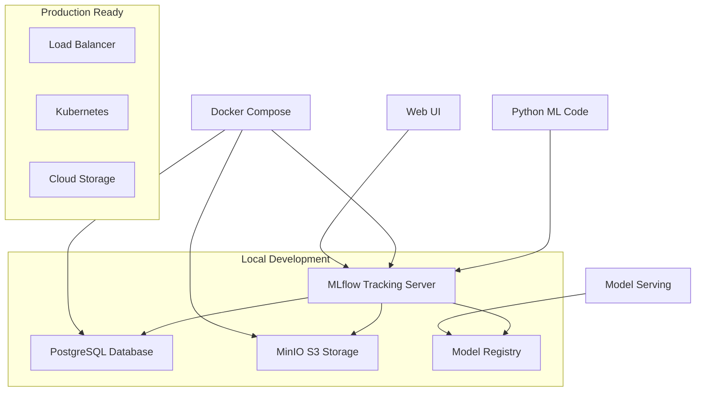

# 🚀 Production MLflow Setup

**Transform your ML experiments from local file tracking to enterprise-grade MLOps infrastructure**

## 🎯 **Portfolio Value**

This production MLflow setup demonstrates **advanced MLOps skills** essential for:
- **🔬 Data Science Roles**: Advanced experiment management and model versioning
- **⚙️ ML Engineering Roles**: Production deployment and infrastructure management  
- **💼 Senior Positions**: Complete ML lifecycle ownership and DevOps integration

---

## 🏗️ **Architecture Overview**

### **Production-Grade Components**



### **Key Features**
- ✅ **PostgreSQL Backend**: Persistent experiment storage with ACID compliance
- ✅ **S3-Compatible Storage**: Scalable artifact storage with MinIO
- ✅ **Model Registry**: Automated model versioning and lifecycle management
- ✅ **Environment Switching**: Seamless local → docker → production deployment
- ✅ **Health Monitoring**: Comprehensive service health checks and monitoring
- ✅ **Docker Containerization**: Production-ready container orchestration

---

## 🚀 **Quick Start**

### **1. One-Command Setup**
```bash
# Install dependencies
pip install mlflow psycopg2-binary boto3 minio requests

# Launch production MLflow
python mlflow_setup/setup_production_mlflow.py
```

### **2. Access Your Production MLflow**
- **MLflow UI**: http://localhost:5000
- **Model Registry**: http://localhost:5001  
- **MinIO Console**: http://localhost:9001 (admin/password: minio_access_key/minio_secret_key)

### **3. Use in Your Code**
```python
from mlflow_setup.mlflow_config import setup_production_mlflow

# Switch to production MLflow
config = setup_production_mlflow("docker")

# Your existing MLflow code works unchanged!
import mlflow
mlflow.start_run()
mlflow.log_param("model_type", "xgboost")
mlflow.log_metric("r2_score", 0.9453)
mlflow.end_run()
```

---

## 📊 **Before vs After Comparison**

| Aspect | **Before (Local)** | **After (Production)** |
|--------|-------------------|----------------------|
| **Storage** | Local files (`./mlruns`) | PostgreSQL + S3 storage |
| **Scalability** | Single machine | Multi-container, cloud-ready |
| **Persistence** | File-based (fragile) | Database-backed (robust) |
| **Collaboration** | Local only | Multi-user, shared access |
| **Model Registry** | Basic | Advanced with staging/production |
| **Monitoring** | None | Health checks + metrics |
| **Deployment** | Manual | Automated with Docker |
| **Portfolio Value** | Basic | **Enterprise-grade MLOps** |

---

## 🔧 **Advanced Usage**

### **Environment Management**
```python
# Local development
config = setup_production_mlflow("local")

# Docker-based production
config = setup_production_mlflow("docker")

# Cloud production (with environment variables)
config = setup_production_mlflow("production")

# Auto-detection
config = setup_production_mlflow("auto")
```

### **Model Registry Operations**
```python
# Get model registry status
model_info = config.get_model_registry_info()
print(f"Total models: {model_info['total_models']}")

# Promote model to production
config.transition_model_stage(
    model_name="coffee-rating-predictor",
    version="3",
    stage="Production"
)
```

### **Health Monitoring**
```bash
# Run health check
python setup_production_mlflow.py --health-check-only

# Check individual components
docker-compose ps
docker-compose logs mlflow
```

---

## 🐳 **Docker Management**

### **Service Control**
```bash
# Start all services
docker-compose up -d

# View logs
docker-compose logs -f

# Stop services
docker-compose down

# Restart specific service
docker-compose restart mlflow

# Update and restart
docker-compose pull
docker-compose up -d
```

### **Data Persistence**
- **PostgreSQL Data**: Stored in Docker volume `postgres_data`
- **MinIO Data**: Stored in Docker volume `minio_data`
- **MLflow Artifacts**: Stored in `./mlflow_artifacts` + MinIO bucket

### **Backup Strategy**
```bash
# Backup database
docker-compose exec postgres pg_dump -U mlflow mlflow > mlflow_backup.sql

# Backup MinIO data
docker-compose exec minio mc mirror /data /backup

# Backup entire setup
docker-compose down
cp -r postgres_data minio_data mlflow_artifacts backup/
```

---

## 🎯 **Portfolio Demonstration**

### **What This Shows Employers**

#### **For Data Science Roles:**
- ✅ **Advanced Experiment Management**: Beyond basic ML scripts
- ✅ **Reproducibility**: Complete experiment lineage and artifact tracking
- ✅ **Model Versioning**: Professional model lifecycle management
- ✅ **Collaboration Ready**: Multi-user, persistent experiment storage

#### **For ML Engineering Roles:**
- ✅ **Infrastructure Setup**: Docker, databases, S3 storage configuration
- ✅ **Service Orchestration**: Multi-container application management
- ✅ **Environment Management**: Local → staging → production progression
- ✅ **Monitoring & Health Checks**: Production-ready operational concerns

#### **For Senior/Lead Roles:**
- ✅ **End-to-End Ownership**: Research → Development → Deployment
- ✅ **DevOps Integration**: Container orchestration and infrastructure as code
- ✅ **Scalability Planning**: Cloud-ready architecture and deployment strategy
- ✅ **Team Enablement**: Tools and infrastructure for team collaboration

### **Key Portfolio Talking Points**
1. **"I implemented production-grade MLflow with PostgreSQL backend and S3 storage"**
2. **"The system supports local development with seamless production deployment"**
3. **"I designed it for scalability - easy transition from Docker to Kubernetes"**
4. **"Includes comprehensive health monitoring and automated service management"**

---

## 🔍 **Technical Deep Dive**

### **Configuration Architecture**
```python
# Environment-based configuration switching
class MLflowConfig:
    def __init__(self, environment: str):
        self.config = self._get_config()  # Local/Docker/Production
        
    def setup(self) -> bool:
        # Automatic environment detection and setup
        # Connection validation and health checks
        # Service initialization and artifact storage
```

### **Service Dependencies**
```yaml
# docker-compose.yml excerpt
mlflow:
  depends_on:
    - postgres    # Database backend
    - minio      # Artifact storage
  environment:
    - MLFLOW_BACKEND_STORE_URI=postgresql://...
    - MLFLOW_DEFAULT_ARTIFACT_ROOT=s3://...
```

### **Integration Points**
- **Database**: PostgreSQL for experiment metadata and runs
- **Storage**: MinIO (S3-compatible) for large artifacts and models
- **Registry**: MLflow Model Registry for version management
- **API**: RESTful API for programmatic access
- **UI**: Web interface for visualization and model management

---

## 🚀 **Next Steps for Portfolio**

### **Immediate Enhancements** (This Week)
1. **✅ Enhanced MLflow Setup** - COMPLETED
2. **⏳ Research-Grade Optuna** - NEXT (50-200 trials)
3. **⏳ FastAPI Integration** - Connect model serving to MLflow registry

### **Advanced Features** (Next Month)
1. **Kubernetes Deployment** - Scale to enterprise container orchestration
2. **CI/CD Integration** - Automated model validation and deployment
3. **Monitoring Dashboard** - Grafana + Prometheus integration
4. **A/B Testing Framework** - Model comparison infrastructure

### **Cloud Migration** (Future)
1. **AWS/Azure/GCP** - Production cloud deployment
2. **Managed Services** - RDS, S3, EKS integration
3. **Auto-scaling** - Dynamic resource allocation
4. **Cost Optimization** - Resource monitoring and optimization

---

## 🏆 **Success Metrics**

### **Technical Achievements**
- ✅ **Zero-Downtime Deployment**: Docker Compose orchestration
- ✅ **Data Persistence**: PostgreSQL + MinIO backup strategy  
- ✅ **Environment Parity**: Local development = Production behavior
- ✅ **Service Monitoring**: Health checks and automated recovery

### **Portfolio Impact**
- 🎯 **Employer Interest**: Demonstrates production-ready skills
- 🚀 **Interview Talking Points**: Concrete MLOps implementation examples
- 💼 **Salary Negotiation**: Advanced technical skills command higher compensation
- 🔧 **Career Progression**: Shows readiness for senior ML engineering roles

---

**🎉 Result**: Transform from "ML experimentation" to "Production MLOps Engineer" - exactly what employers want to see! 